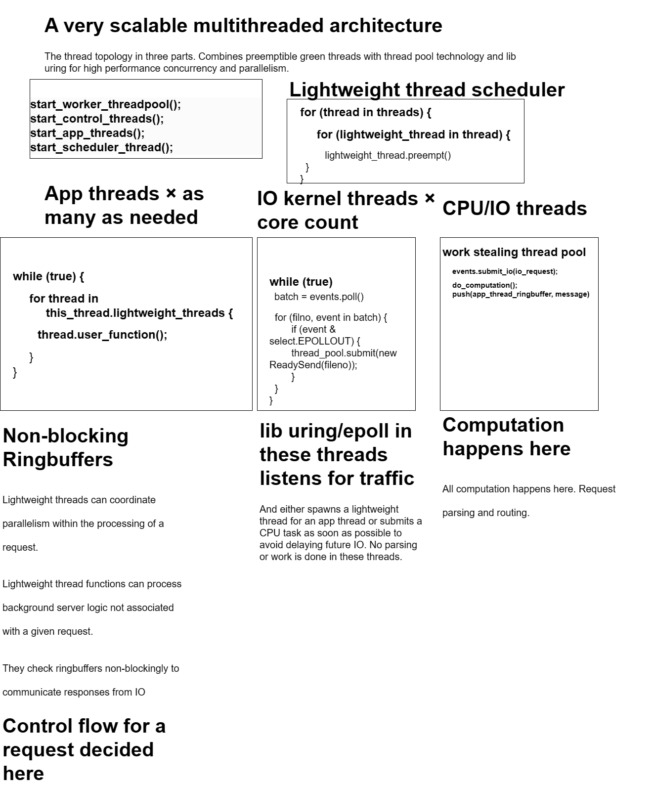

# three-tier-multithreaded-architecture

This is a design for multithreaded servers that you can adopt for scalability.

* Please email sam@samsquire.com or add a PR if you want to add notes

Thanks to these people for comments on this architecture.

|Person|Where to find them|
|---|---|
|Verdagon|https://vale.dev/|
|icefox|Vale discord|

# design

This is a server architecture which has three types of kernel threads: **app/IO/CPU**:
 * **CPU threads** - traditional work stealing worker thread pool 
 * **IO threads** - handle IO scalably
 * **App threads** - coordinate parallelism of CPU and IO with lightweight threads. Hot loops in these threads can be preempted with the technique from [samsquire/preemptible-thread](https://github.com/samsquire/preemptible-thread)

# diagram

* Splits work into `app threads/IO threads/CPU threads`
* Use work stealing thread pools for heavy CPU tasks
* Use lightweight threads for event loops, parallelism and request coordination
* Use `liburing` or `epoll` for IO scalability
* Use multiproducer multiconsumer lockless ringbuffers for communication.

 # App threads

These are **Controllers** for app logic. They are round robined by the lightweight thread runtime. As a result, they should do no high CPU or IO. They should send IO and CPU requests to either an event for the IO threads to pick up or submit a task for the CPU thread pool. 

These are lightweight threads that are multiplexed over kernel threads and they can yield.

# IO Threads

* These receive IO events and then send events for futher IO or spawn lightweight threads or spawn thread pool tasks for heavy CPU use. 
* When a socket is ready to send data, we would wait for `EPOLLOUT` event and then send any queued data to send.

# CPU Threads

* A work stealing thread pool is used for CPU tasks. 
